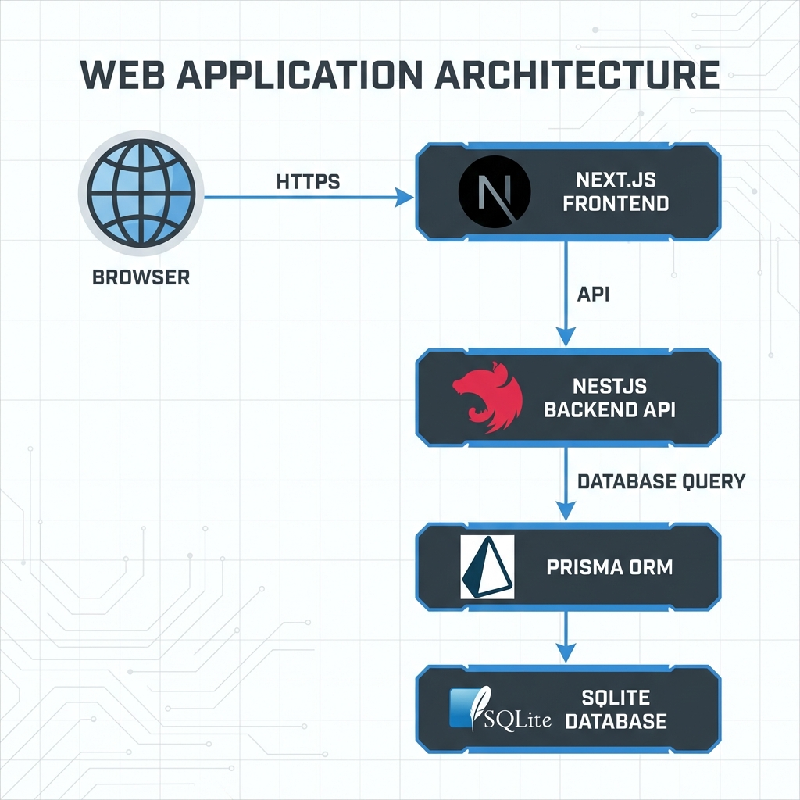
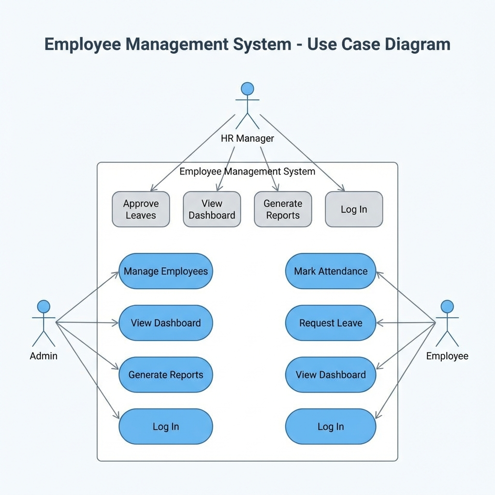
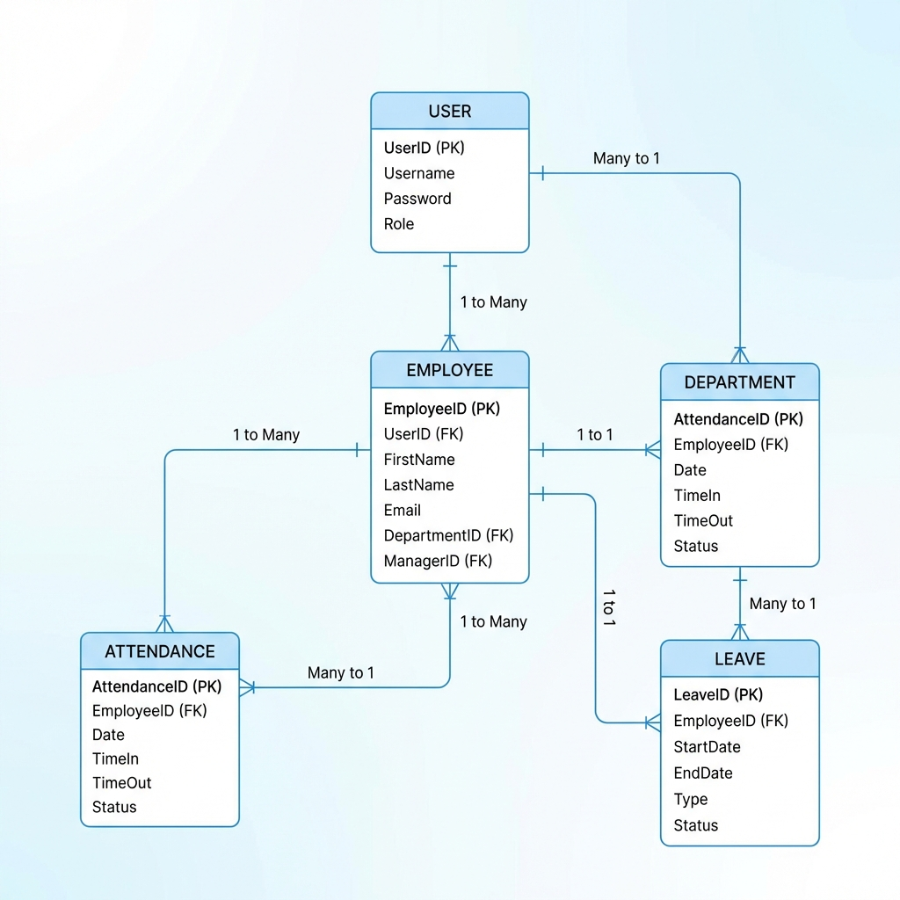

# Technical Architecture & System Documentation
## Employee Management System (EMS)

---

## 🏗️ 1. Infrastructure & Tech Stack Rationale

### 1.1 Core Architecture
The system follows a **Decoupled Client-Server Architecture**, ensuring that the Frontend and Backend can scale independently and communicate via a secure RESTful API.

### 1.2 The Stack
| Component | Technology | Rationale |
| :--- | :--- | :--- |
| **Backend** | **NestJS** | Provides a robust, disciplined architecture with built-in support for Dependency Injection and modularity. |
| **Frontend** | **Next.js 15** | App Router and React Server Components bring superior performance and SEO capabilities. |
| **Build Tool** | **Turbopack** | Hand-picked for the frontend to provide the fastest possible HMR and build speeds in a modern React environment. |
| **ORM** | **Prisma** | Offers unparalleled type safety and auto-generated clients, reducing runtime errors and boilerplate. |
| **Database** | **SQLite** | Chosen for local development to ensure zero-config setups and 100% portability via a single file (`dev.db`). |

---

## 📊 2. System Flow & Diagrams

### 2.1 High-Level System Architecture

### 2.2 Functional Use Case Diagram

### 2.3 Database Entity Relationship (ER) Diagram

### 2.4 Authentication Flow (Sequence Diagram)

---

## ⚙️ 3. Core Logic Implementation

### 3.1 Role-Based Access Control (RBAC)
The system utilizes a custom `@Roles()` decorator and a `RolesGuard`. This ensures that sensitive operations (like deleting an employee or approving a leave) are strictly limited to authorized roles.

**Access Matrix:**
- **ADMIN**: Global system access, user management, and configuration.
- **HR**: Operational management including record tracking, attendance monitoring, and leave approvals.
- **EMPLOYEE**: Personal dashboard access, attendance logging, and leave request submission.

### 3.2 Attendance Monitoring System
The attendance module implements a strict daily integrity constraint. 
- **Automated Logging**: Captures specific check-in and check-out timestamps.
- **Status Classification**: Automatically assigns statuses based on time thresholds:
    - **PRESENT**: On-time check-in.
    - **LATE**: Check-in after the grace period.
    - **ABSENT**: No check-in recorded for the operational window.

### 3.3 Leave Management Lifecycle
The leave system follows a state-machine workflow:
1. **Submission**: Employee submits request with type (SICK, ANNUAL, etc.) and reason.
2. **Review**: HR/Admin reviews the request in a centralized queue.
3. **Decision**: Request is either Approved or Rejected with relevant notes.
4. **Audit**: All actions are timestamped and signed by the reviewer for administrative accountability.

---

## 🚀 4. Performance & Scalability

### 4.1 Native Turbopack Optimization
By utilizing Next.js 15 with Turbopack, the frontend benefits from an incremental compilation engine. This results in **700x faster execution** of changes during development compared to traditional Webpack setups.

### 4.2 Portable Database Strategy (SQLite to Enterprise)
The use of Prisma as an abstraction layer enables a "Zero-Friction" migration path. While we currently use SQLite for its zero-config benefits and portability, transitioning to a production-grade PostgreSQL or MySQL cluster requires only a single environment variable update.

---

## 📝 5. Conclusion
This Employee Management System represents a fusion of modern performance tools (Turbopack, Next.js 15) and structured backend practices (NestJS, Prisma). It provides a secure, fast, and scalable foundation for corporate HR operations.
