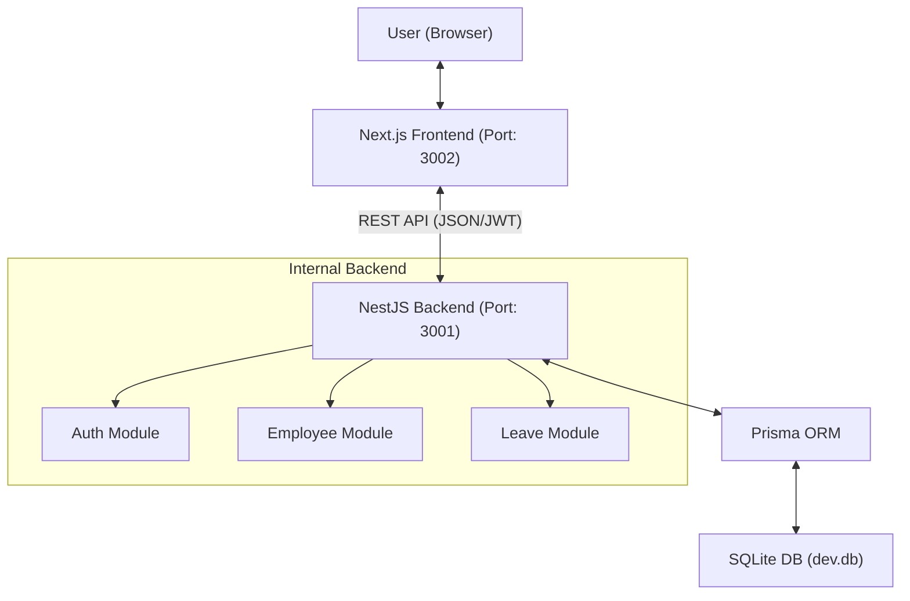
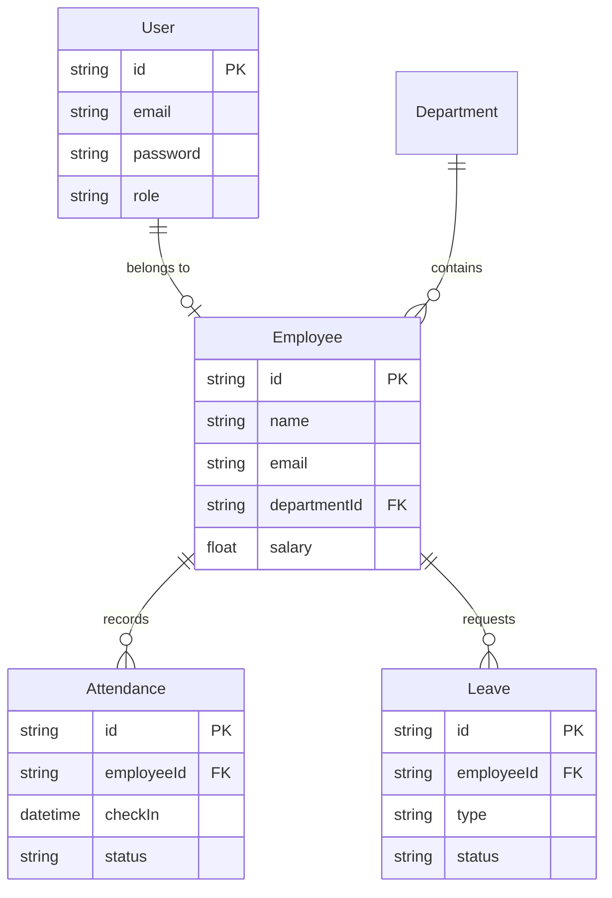
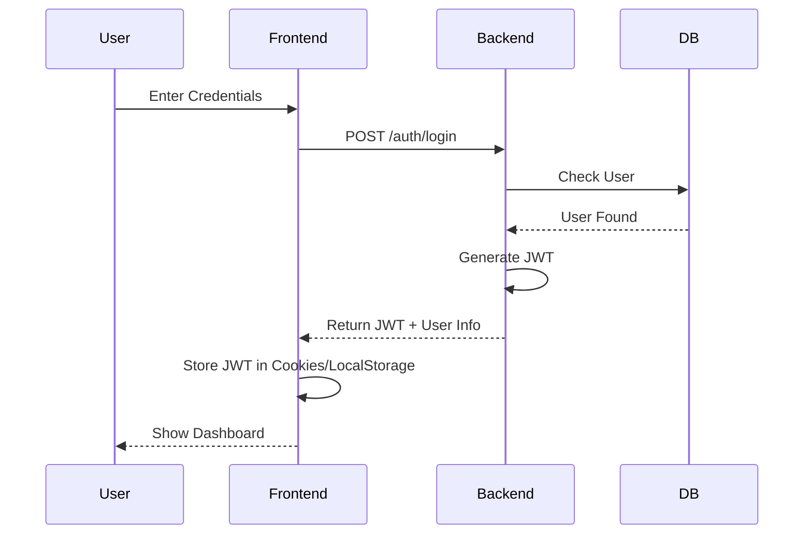

# Technical Architecture & System Documentation
## Employee Management System (EMS)

---

## 🏗️ 1. Infrastructure & Tech Stack Rationale

### 1.1 Core Architecture
The system follows a **Decoupled Client-Server Architecture**, ensuring that the Frontend and Backend can scale independently and communicate via a secure RESTful API.

### 1.2 The Stack
| Component | Technology | Rationale |
| :--- | :--- | :--- |
| **Backend** | **NestJS** | Provides a robust, disciplined architecture with built-in support for Dependency Injection and modularity. |
| **Frontend** | **Next.js 15** | App Router and React Server Components bring superior performance and SEO capabilities. |
| **Build Tool** | **Turbopack** | Hand-picked for the frontend to provide the fastest possible HMR and build speeds in a modern React environment. |
| **ORM** | **Prisma** | Offers unparalleled type safety and auto-generated clients, reducing runtime errors and boilerplate. |
| **Database** | **SQLite** | Chosen for local development to ensure zero-config setups and 100% portability via a single file (`dev.db`). |

---

## 📊 2. System Flow & Diagrams

### 2.1 High-Level System Architecture

### 2.2 Database Entity Relationship (ER) Diagram

### 2.3 Authentication Flow

---

## ⚙️ 3. Core Logic Implementation

### 3.1 Role-Based Access Control (RBAC)
The system utilizes a custom `@Roles()` decorator and a `RolesGuard`. This ensures that sensitive operations (like deleting an employee or approving a leave) are strictly limited to authorized roles.

**Access Matrix:**
- **ADMIN**: Global access.
- **HR**: Manage records, monitor attendance, process leaves.
- **EMPLOYEE**: Personal dashboard, self-check-in, leave requests.

### 3.2 Attendance Logic
- **Constraint**: Only one record per employee per day.
- **Status Mapping**: Automated status assignment (PRESENT, LATE, ABSENT) based on check-in timestamps.

### 3.3 Leave Workflow
1. **Initiation**: Employee submits a request.
2. **Pending State**: Request is visible to HR/Admin.
3. **Action**: HR/Admin approves/rejects with comments.
4. **State Finalization**: Status updates and timestamps are recorded for audit logs.

---

## 🚀 4. Performance Optimization

### 4.1 Turbopack
By leveraging Turbopack, we've reduced the frontend cold-boot time by significantly. It optimizes the build graph incrementally, ensuring that only the changed modules are re-compiled during development.

### 4.2 SQLite in Production VS Development
While SQLite is used for local delivery and easy testing, the **Prisma Abstraction Layer** allows for a seamless transition to **PostgreSQL** or **MySQL** in a production environment by simply changing the `DATABASE_URL` in the `.env` file.

---

## 🛠️ 5. Maintenance & Scaling
- **Migrations**: Always use `npx prisma migrate dev` to maintain schema integrity.
- **Seeding**: Use `npx ts-node prisma/seed.ts` to refresh the environment with reliable test data.
- **Frontend Components**: Utilize the `components` folder for atomic UI elements, ensuring reusability across pages.

---

## 📝 6. Conclusion
The EMS is not just a tool, but a platform built with modern software engineering principles. By combining **Type Safety**, **Modular Architecture**, and **Ultra-Fast Tooling**, it provides a premium experience for both users and developers.
